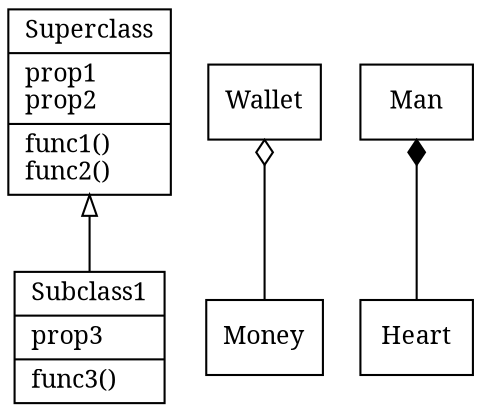

- Wallet can have money (Aggregation)
- Man has Heart (Composition)
- BUG: `Color -> Rainbow  [arrowtail=crow arrowhead=odiamond]` inverts tail and head
- BUG: mermaid class diagram is good but allows only one diagram per file

# Links

- [UML Class Diagrams Tutorial, Step by Step](https://medium.com/@smagid_allThings/uml-class-diagrams-tutorial-step-by-step-520fd83b300b)
- http://www.graphviz.org/pdf/dotguide.pdf
- https://mermaidjs.github.io/#/classDiagram