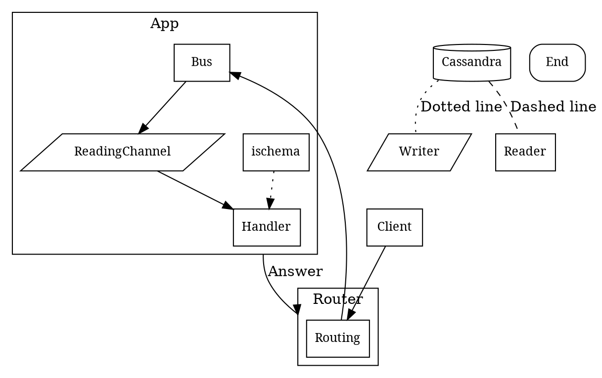

```dot
digraph graphname {
    node [ fontname = "Cambria" shape = "rect" fontsize = 12]
    compound=true

    subgraph cluster_router {
        label = "Router"
        Routing
    }
    subgraph cluster_app {
        label = "App";
        Handler
        ischema
        Bus
        ReadingChannel
    }

    Cassandra[shape=cylinder]
    Writer[shape=parallelogram]
    ReadingChannel[shape=parallelogram]
    End[style=rounded]

    Client -> Routing
    Handler -> Routing [label="Answer" ltail=cluster_app lhead=cluster_router]
    Routing -> Bus
    Bus -> ReadingChannel
    ReadingChannel -> Handler
    ischema -> Handler[style=dotted]


    Cassandra -> Writer [label="Dotted line" style=dotted dir=none]
    Cassandra -> Reader [label="Dashed line" style=dashed dir=none]    
}
```

# Links

- https://stackoverflow.com/questions/7115870/creating-straight-edges-in-graphviz