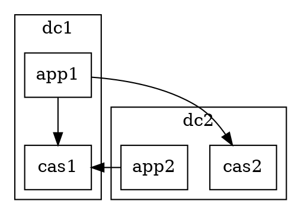

# Graphviz Links

- http://www.graphviz.org/documentation/
  - https://graphviz.gitlab.io/_pages/doc/info/shapes.html
  - https://graphviz.gitlab.io/_pages/doc/info/arrows.html
- `Cluster`: https://graphviz.gitlab.io/_pages/Gallery/directed/cluster.html
- http://www.graphviz.org/doc/info/attrs.html
- http://www.graphviz.org/gallery/

# Problems

- Found problem https://gitlab.com/graphviz/graphviz/issues/1624
  - Removing node [ shape = "record"] fixes the problem
  - shape = "rect" fixes the problem

  

