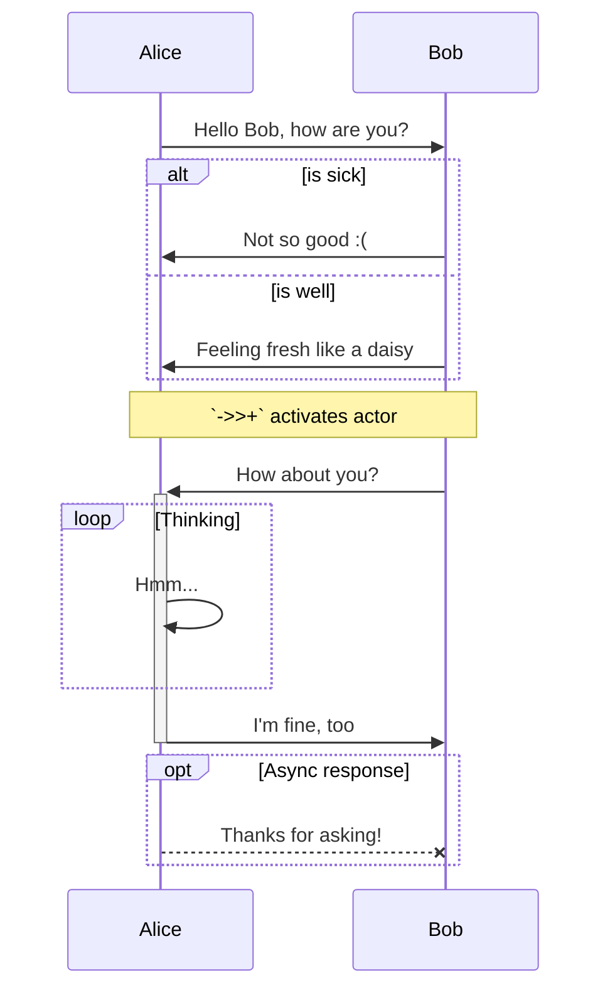

```mermaid
sequenceDiagram
    participant A as Alice
    participant B as Bob
    A->>B: Hello Bob, how are you?
    alt is sick
        B->>A: Not so good :(
    else is well
        B->>A: Feeling fresh like a daisy
    end

    Note over A, B: `->>+` activates actor
    B->>+A: How about you?
    loop Thinking
        A ->> A: Hmm...
    end
    A ->>- B: I'm fine, too
    opt Async response
        A--xB: Thanks for asking!
    end
```

See also
- https://mermaidjs.github.io/#/sequenceDiagram