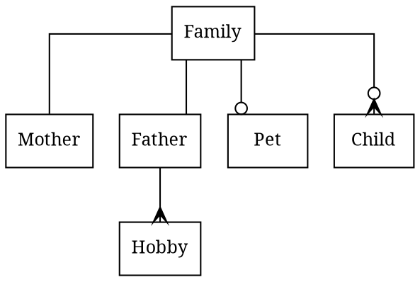

- Family has exactly one Father and Mother
- Family has zero or one Pet
- Father has many hobbies
- Family has zero or few kids

# Links 

- http://blog.konca.com/2013/08/25/draws-uml-class-diagram-with-graphviz/