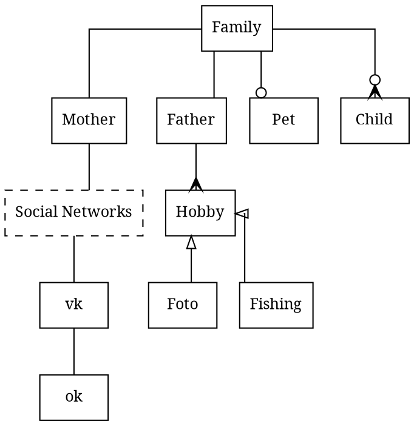

- Family has exactly one Father and Mother
- Family has zero or one Pet
- Father has one or few hobbies
- Hobby can be `Foto` or `Fishing` 
  - `Foto` and `Fishing` are subclasses of `Hobby` class
- Family has zero or few kids
- Mother is a member of `vk` and `ok` social networks
- `vk`, `ok` - ordered items of `Social Networks` list

# Links 

- http://blog.konca.com/2013/08/25/draws-uml-class-diagram-with-graphviz/